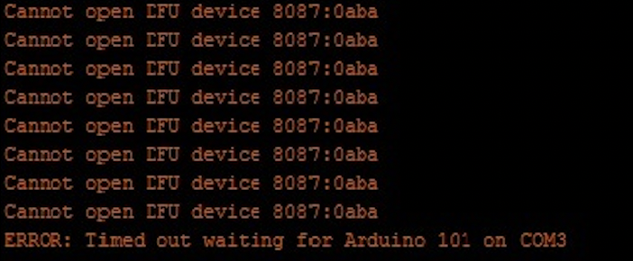

## Manual CanineConnect  

 Door Laura van Rooijen
 
 Minor Artificial Intelligence
 Internet of things
 David de Vries & Harm van Vugt

## Table of Contents

1. [Introduction](#introduction)
2. [Hardware Requirements](#HardwareRequirements)
3. [Software Requirements](#SoftwareRequirements)
4. [Installing the Servo Library](#installingtheServoLibrary)
5. [Wiring Instructions](#wiringinstructions)
6. [Uploading the code](#troubleshooting)
7. [Using the Treat Dispenser](#usingthetreatdispenser)
8. [Customization](#customization)
9. [Safety Precautions](#SafetyPrecautions)
10.[Troubleshooting](#troubleshooting)
11. [Conclusion](#conclusion)

## 1. Introduction
The Arduino Treat Dispenser is a simple project that allows you to control a servo motor to dispense treats for your pet. With the provided code and instructions, you can set up a basic treat dispenser that can be triggered by a button press.
 

## 2. Hardware Requirements
To build the treat dispenser, you will need the following components:

- Arduino board (e.g., Arduino Uno)
- Servo motor
- Momentary push-button switch
- Jumper wires
- Power source for the servo (usually 5V)
 

## 3. Software Requirements
You will need the Arduino IDE (Integrated Development Environment) to upload the code to your Arduino board. You can download the Arduino IDE from the official Arduino website (https://www.arduino.cc/en/software).
 

 

## 4. Installing the Servo Library
To control the servo motor, you need to install the Servo library. Here's how to do it:
1. Open the Arduino IDE.
2. Go to "Sketch" > "Include Library" > "Servo."
3. This will include the Servo library in your project, allowing you to control the servo motor.

 
 

## 5. Wiring Instructions
Connect the components as follows:

4. Servo motor:
- Signal (S) wire to digital pin 9 on the Arduino.
- Power (V) wire to a 5V source.
- Ground (GND) wire to the Arduino's ground (GND).
5. Push-button switch:
- One pin connected to digital pin 2 on the Arduino.
- The other pin connected to the Arduino's ground (GND).
 

## 6. Uploading the code
1. Open the Arduino IDE.
2. Copy and paste the provided code (from my previous response) into a new sketch.
3. Save your sketch with a meaningful name.
4. Connect your Arduino board to your computer using a USB cable.
5. Select the correct board type from "Tools" > "Board."
6. Select the correct port from "Tools" > "Port."
7. Click the "Upload" button to upload the code to your Arduino board.
 

## 7. Using the Treat Dispenser
1. After uploading the code, the treat dispenser is ready to use.
2. Press the push-button switch connected to pin 2 to dispense a treat.
3. The servo will move to the specified angle (adjust as needed), dispense the treat, and return to its initial position.
4. You can modify the code to customize the angle and timing to suit your needs.

## 8. Customization
You can customize the code by:
- Adjusting the servo angle in the code to control the treat dispensing duration.
- Modifying the delay times to change how long the servo holds the treat dispenser position.
 

## 9. Safety Precautions
- Ensure that your hardware connections are secure to prevent accidents.
- Be cautious when using a servo with a mechanical treat dispenser to prevent injury to your dog.
- Keep the Arduino and wires out of your dog's reach to avoid damage.
 

## 10. Troubleshooting
- Error Code 1: "Servo Not Properly Connected (Error: S-101)"
 
  - Explanation: This error indicates that the servo motor is not correctly connected to the Arduino or the power source.
  - Solution: Double-check the wiring: Ensure that the servo's signal wire is connected to the correct digital pin (e.g., pin 9), the power (V) wire is connected to a 5V source, and the ground (GND) wire is connected to the Arduino's ground (GND).
Verify the servo power source: Ensure that the servo is receiving power from a stable 5V source. Check the voltage and make sure it's within the servo's operating range.

- Error Code 2:"Error: 'delay' was not declared in this scope" 
 
  - Explanation: This error occurs when you attempt to use the delay() function, but the Arduino IDE does not recognize it. The delay() function is a built-in Arduino function used to pause the program's execution for a specified duration, but in this case, something is preventing the Arduino IDE from understanding and locating this function.
  - Solution: To resolve this error, consider the following steps:
    1. Check for Typos: Ensure that the delay() function is spelled correctly. It should be all lowercase, and the parentheses must be correctly placed. It should look like this: delay(milliseconds);.
    2. Library Modifications: Sometimes, unintentional modifications to the Arduino core libraries can lead to this error. Revert any changes you may have made to these libraries.
    3. Reinstallation of the Arduino IDE: If the problem persists, consider reinstalling the Arduino IDE. Sometimes, incorrect installations or corruption of program files can cause these issues.
    4. Arduino Core Update: Ensure that you are using an up-to-date version of the Arduino core for your specific board. Outdated or incompatible versions can sometimes lead to errors like this.

 

## 11. Conclusion
The Canine Treat Dispenser Arduino code is a simple way to control a treat dispenser for your dog. With this code, you can easily reward your pet with treats, enhancing training and playtime. Enjoy using this code to make your dog's day even more enjoyable!
